# Communication Skills - Detailed Mindmap

```mermaid
mindmap
  root((Communication Skills
    for Software Engineers))
    Technical to Non-Technical Communication
      Framework
        Start with Problem
        Use Analogies
        Focus on Benefits
        Use Visuals
        Invite Questions
        Confirm Understanding
      Audience Adaptation
        Finance: Accounts, Ledgers, Interest
        Marketing: Campaigns, Funnels, Journeys
        Network Engineers: Routers, Bandwidth
        Business Users: Daily Life Examples
      Examples
        Poor: Technical Jargon
        Good: Simple Analogies
        Email Templates
        Meeting Presentations
    Technical Documentation
      Types
        README Files
          Project Overview
          Prerequisites
          Installation Steps
          Usage Examples
          Configuration
          Troubleshooting
        API Documentation
          Endpoint Descriptions
          Request/Response Examples
          Authentication
          Error Codes
          Rate Limits
        Architecture Docs
          System Diagrams
          Component Descriptions
          Data Flow
          Technology Stack
          Scalability Considerations
      Best Practices
        Clear Structure
        Code Examples
        Visual Diagrams
        Searchable Format
        Version Control
        Regular Updates
      Tools
        Markdown
        JSDoc
        Swagger/OpenAPI
        Mermaid Diagrams
        Confluence
        GitHub Wiki
    Code Reviews
      Positive Feedback
        Acknowledge Good Work
        Specific Praise
        Encourage Learning
        Build Confidence
      Constructive Criticism
        Focus on Code, Not Person
        Suggest Alternatives
        Explain Why
        Use Questions
        Provide Examples
      Review Structure
        Start with Positives
        Group Related Comments
        Prioritize Issues
        Offer Help
        End Encouragingly
      Communication Style
        Non-Blocking: "Consider", "Suggestion"
        Blocking: "Must fix", "Security issue"
        Questioning: "What if...?", "Have you considered...?"
        Educational: Explain patterns
      Common Patterns
        Security Issues
        Performance Problems
        Code Maintainability
        Test Coverage
        Documentation Gaps
    Cross-Team Collaboration
      Communication Channels
        Slack/Teams
          Quick Questions
          Status Updates
          Informal Discussion
          Channel Organization
        Email
          Formal Communication
          Documentation Trail
          External Communication
          Multiple Stakeholders
        Video Calls
          Complex Discussions
          Pair Programming
          Sprint Planning
          Demos
        Documentation
          Persistent Knowledge
          Asynchronous Learning
          Reference Material
          Onboarding
      Collaboration Patterns
        Clear Ownership
        Response Times
        Escalation Paths
        Decision Documentation
        Meeting Notes
      Conflict Resolution
        Active Listening
        Focus on Facts
        Find Common Ground
        Escalate When Needed
        Document Decisions
      Remote Work Best Practices
        Overcommunicate
        Use Video When Possible
        Respect Time Zones
        Clear Async Updates
        Virtual Social Events
    Effective Meetings
      Meeting Types
        Sprint Planning
          Review Previous Sprint
          Define Goals
          Estimate Stories
          Capacity Planning
          Commitments
        Stand-ups
          What Done Yesterday
          What Doing Today
          Any Blockers
          Keep it Brief 15 min
        Retrospectives
          What Went Well
          What Can Improve
          Action Items
          Follow-up
        Technical Design Reviews
          Architecture Overview
          Trade-offs Discussion
          Security Considerations
          Scalability Analysis
          Decision Making
      Meeting Preparation
        Clear Agenda
        Pre-read Materials
        Time Allocation
        Decision Points
        Expected Outcomes
      During Meeting
        Start on Time
        Follow Agenda
        Take Notes
        Track Action Items
        Parking Lot for Off-topic
        End with Summary
      After Meeting
        Share Notes Quickly
        Assign Action Items
        Set Deadlines
        Follow-up
        Archive for Reference
      Status Updates
        Weekly Format
          Goals vs Actuals
          Key Metrics
          Accomplishments
          In Progress
          Blockers
          Next Week Plan
          Risks
          Questions
        Templates
          Executive Summary
          Detailed Breakdown
          Visual Progress
          Links to Work
        Communication Style
          Facts over Opinions
          Quantify When Possible
          Highlight Blockers
          Ask for Help
          Give Credit
    Incident Communication
      Severity Levels
        P1 Critical
          Complete Outage
          Data Loss Risk
          Security Breach
          Immediate Response
        P2 Major
          Degraded Performance
          Feature Unavailable
          Workaround Exists
          2-Hour Response
        P3 Minor
          Small Bug
          Non-critical Feature
          Low User Impact
          Next Business Day
      Incident Phases
        Detection
          Alert Triggered
          User Reports
          Monitoring Dashboard
          Log Analysis
        Investigation
          War Room Setup
          Team Assembly
          Initial Analysis
          Communication Start
        Identification
          Root Cause Found
          Impact Assessment
          Solution Identified
          Timeline Estimate
        Resolution
          Fix Deployed
          Verification
          Monitoring
          All-Clear
        Post-Mortem
          Timeline Review
          Root Cause Analysis
          What Went Well
          What Went Wrong
          Action Items
          Prevention Measures
      Communication Templates
        Initial Alert
          Status
          Severity
          Start Time
          Affected Services
          Impact
          Current Actions
          Next Update Time
        Updates
          New Information
          Progress Made
          ETA Changes
          Workarounds
        Resolution
          Services Restored
          Impact Summary
          Next Steps
          Thank You
      Stakeholder Management
        Internal Teams
        External Customers
        Management
        Support Team
        Marketing/PR
    Mentoring & Knowledge Sharing
      Mentoring Approach
        1-on-1 Sessions
          Progress Check-in
          Technical Discussion
          Career Development
          Action Items
        Teaching Methods
          Ask Questions First
          Explain Options
          Discuss Trade-offs
          Let Them Decide
          Provide Resources
        Growth Areas
          Technical Skills
          Soft Skills
          Career Goals
          Leadership
          Specialization
      Knowledge Sharing Formats
        Tech Talks
          Clear Hook
          Visual Aids
          Live Demos
          Hands-on Exercise
          Q&A Session
          Resources
        Tutorials
          Step-by-step Guide
          Prerequisites
          Learning Objectives
          Code Examples
          Checkpoints
          Troubleshooting
          Next Steps
        Code Examples
          Well-commented
          Progressive Complexity
          Best Practices
          Common Pitfalls
          Alternative Approaches
        Documentation
          Getting Started
          API Reference
          How-to Guides
          Architecture
          FAQ
      Knowledge Repositories
        Internal Wiki
        GitHub Repos
        Slack Channels
        Video Library
        Code Reviews
        Brown Bag Sessions
      Feedback Loop
        Regular Check-ins
        Anonymous Surveys
        Iterate Content
        Update Materials
        Measure Impact
```



---

## Hierarchical Text Version

### 1. TECHNICAL TO NON-TECHNICAL COMMUNICATION

#### 1.1 Communication Framework
- **Step 1**: Start with the Problem (Business Impact)
- **Step 2**: Use Analogies from Their Domain
- **Step 3**: Focus on Benefits, Not Implementation
- **Step 4**: Use Visuals When Possible
- **Step 5**: Invite Questions
- **Step 6**: Confirm Understanding

#### 1.2 Audience Adaptation Strategies
- **Finance Professionals**
  - Use: Accounts, Ledgers, Interest, Debit/Credit
  - Example: "Like reconciling accounts at month-end"
  
- **Marketing Team**
  - Use: Campaigns, Customer Journeys, Funnels, Conversion
  - Example: "Like optimizing a conversion funnel"
  
- **Network Engineers**
  - Use: Routers, Bandwidth, Packets, Protocols
  - Example: "Like configuring BGP routing"
  
- **Business Users**
  - Use: Daily Life Examples, Simple Metaphors
  - Example: "Like organizing files in folders"

#### 1.3 Communication Examples
- **Poor Communication**: Technical jargon, acronyms, implementation details
- **Good Communication**: Simple language, clear benefits, relatable analogies
- **Email Templates**: Problem → Impact → Solution → Benefits
- **Presentation Templates**: Story format, visuals, demos

---

### 2. TECHNICAL DOCUMENTATION

#### 2.1 README Files
- **Project Overview**
  - What it does
  - Why it exists
  - Key features
  
- **Prerequisites**
  - Required software
  - Environment setup
  - Dependencies
  
- **Installation**
  - Step-by-step guide
  - Platform-specific instructions
  - Verification steps
  
- **Usage**
  - Basic examples
  - Common use cases
  - Configuration options
  
- **Troubleshooting**
  - Common issues
  - Error messages
  - Solutions
  
- **Contributing**
  - Guidelines
  - Process
  - Standards

#### 2.2 API Documentation
- **Endpoints**
  - URL patterns
  - HTTP methods
  - Path parameters
  
- **Request Format**
  - Headers
  - Body schema
  - Query parameters
  
- **Response Format**
  - Success responses
  - Error responses
  - Status codes
  
- **Authentication**
  - Methods
  - Token handling
  - Permissions
  
- **Examples**
  - cURL commands
  - Code snippets (multiple languages)
  - Live playground
  
- **Rate Limits**
  - Limits per endpoint
  - Headers
  - Handling

#### 2.3 Architecture Documentation
- **System Overview**
  - High-level architecture
  - Component diagram
  - Data flow
  
- **Components**
  - Purpose
  - Responsibilities
  - Dependencies
  
- **Technology Stack**
  - Languages
  - Frameworks
  - Infrastructure
  
- **Design Decisions**
  - Why this approach
  - Trade-offs
  - Alternatives considered
  
- **Scalability**
  - Current capacity
  - Bottlenecks
  - Future plans

#### 2.4 Documentation Best Practices
- **Structure**: Logical organization, table of contents
- **Code Examples**: Working, tested, multiple scenarios
- **Visuals**: Diagrams, flowcharts, screenshots
- **Searchability**: Keywords, index, tags
- **Maintenance**: Version control, regular updates, ownership
- **Accessibility**: Clear language, multiple formats

---

### 3. CODE REVIEWS

#### 3.1 Positive Feedback Techniques
- **Acknowledge Good Work**
  - "Great refactoring here!"
  - "Nice use of the Factory pattern"
  - "Well-structured tests"
  
- **Be Specific**
  - Not: "Looks good"
  - Instead: "I like how you extracted the validation logic into a separate function"
  
- **Encourage Learning**
  - "Interesting approach! I learned something new"
  - "Creative solution to the caching problem"
  
- **Build Confidence**
  - Especially for junior developers
  - Highlight improvements
  - Recognize effort

#### 3.2 Constructive Criticism
- **Focus on Code, Not Person**
  - Not: "You made a mistake"
  - Instead: "This code has a potential memory leak"
  
- **Suggest Alternatives**
  - "Consider using X instead of Y"
  - Provide code examples
  - Explain trade-offs
  
- **Explain Why**
  - "This could cause performance issues because..."
  - "Security concern: This is vulnerable to XSS attacks"
  
- **Use Questions**
  - "Have you considered...?"
  - "What if the user inputs...?"
  - "Could this fail when...?"

#### 3.3 Review Structure
1. **Start with Positives**
   - What's done well
   - Good patterns used
   
2. **Group Comments**
   - By severity
   - By file/component
   - By type (security, performance, style)
   
3. **Prioritize**
   - Must-fix (blocking)
   - Should-fix (important)
   - Nice-to-have (suggestions)
   
4. **Offer Help**
   - "Happy to pair on this"
   - "Let me know if you need clarification"
   
5. **End Encouragingly**
   - "Almost there!"
   - "Looking forward to the next iteration"

#### 3.4 Comment Types
- **Non-blocking Suggestions**
  - "nit:", "suggestion:", "consider:"
  - Optional improvements
  - Style preferences
  
- **Blocking Issues**
  - "Must fix before merge"
  - Security vulnerabilities
  - Breaking changes
  - Test failures
  
- **Questions**
  - Seeking clarification
  - Understanding intent
  - Edge cases
  
- **Educational**
  - Explaining patterns
  - Sharing knowledge
  - Best practices

---

### 4. CROSS-TEAM COLLABORATION

#### 4.1 Communication Channels

**Slack/Teams**
- **When to Use**
  - Quick questions
  - Real-time discussion
  - Status updates
  - Informal chat
  
- **Best Practices**
  - Use threads
  - Right channel selection
  - @mentions appropriately
  - Emoji reactions
  - Pin important messages
  
- **Channel Organization**
  - #team-[name]: Team-specific
  - #project-[name]: Project work
  - #help-[topic]: Q&A channels
  - #announcements: Important updates

**Email**
- **When to Use**
  - Formal communication
  - External parties
  - Multiple stakeholders
  - Documentation trail
  - Long-form content
  
- **Best Practices**
  - Clear subject lines
  - Concise content
  - Action items highlighted
  - Appropriate CC/BCC
  - Professional tone

**Video Calls**
- **When to Use**
  - Complex discussions
  - Pair programming
  - Sprint ceremonies
  - Demos
  - Sensitive topics
  
- **Best Practices**
  - Camera on when possible
  - Good audio setup
  - Mute when not speaking
  - Share screen for demos
  - Record for absent members

**Documentation**
- **When to Use**
  - Persistent knowledge
  - Asynchronous learning
  - Reference material
  - Onboarding
  - Decision records
  
- **Best Practices**
  - Keep updated
  - Easy to find
  - Searchable
  - Version controlled
  - Clear ownership

#### 4.2 Collaboration Patterns
- **Clear Ownership**
  - DRI (Directly Responsible Individual)
  - RACI matrix
  - Responsibility boundaries
  
- **Response Time Expectations**
  - Urgent: < 1 hour
  - Important: Same day
  - Normal: Within 24 hours
  - Low priority: Within 3 days
  
- **Escalation Paths**
  - When to escalate
  - Who to escalate to
  - How to escalate
  
- **Decision Documentation**
  - Architecture Decision Records (ADRs)
  - Meeting notes
  - Email summaries
  - Wiki pages

#### 4.3 Conflict Resolution
- **Active Listening**
  - Understand before responding
  - Paraphrase to confirm
  - Ask clarifying questions
  
- **Focus on Facts**
  - Data over opinions
  - Objective criteria
  - Avoid personal attacks
  
- **Find Common Ground**
  - Shared goals
  - Win-win solutions
  - Compromise
  
- **Escalate When Needed**
  - Know your limits
  - Involve management
  - Document everything
  
- **Document Decisions**
  - Why decision was made
  - Who was involved
  - Action items
  - Follow-up plan

#### 4.4 Remote Work Best Practices
- **Overcommunicate**
  - More is better than less
  - Assume others don't know
  - Repeat important info
  
- **Use Video**
  - Build rapport
  - Read body language
  - Reduce misunderstanding
  
- **Respect Time Zones**
  - Schedule fairly
  - Rotate meeting times
  - Async alternatives
  
- **Clear Async Updates**
  - Written status reports
  - Recorded demos
  - Comprehensive docs
  
- **Virtual Social**
  - Coffee chats
  - Team games
  - Show and tell
  - Celebrate wins

---

### 5. EFFECTIVE MEETINGS

#### 5.1 Sprint Planning
**Structure:**
- Sprint review (10 min)
- Sprint goals (15 min)
- Story review & estimation (45 min)
- Capacity planning (10 min)
- Commitments (10 min)

**Preparation:**
- Backlog groomed
- Stories defined
- Technical design ready

**Output:**
- Sprint backlog
- Team commitments
- Dependencies identified

#### 5.2 Daily Stand-ups
**Format (15 min max):**
- What I did yesterday
- What I'm doing today
- Any blockers

**Best Practices:**
- Stand (keeps it short)
- Same time daily
- Park detailed discussions
- Update board during
- Focus on commitment

#### 5.3 Retrospectives
**Structure:**
- What went well ✅
- What can improve 🔄
- Action items 📋

**Techniques:**
- Start-Stop-Continue
- Mad-Sad-Glad
- 4 Ls: Liked, Learned, Lacked, Longed for
- Timeline

**Follow-up:**
- Review previous actions
- Track improvements
- Celebrate wins

#### 5.4 Technical Design Reviews
**Agenda:**
1. Problem statement
2. Proposed solution
3. Architecture diagram
4. Trade-offs
5. Security considerations
6. Scalability analysis
7. Alternative approaches
8. Decision & next steps

**Participants:**
- Designer (presenter)
- Architects
- Tech leads
- Stakeholders
- Security team

**Output:**
- Approved design
- Action items
- Open questions
- Decision record

#### 5.5 Status Updates
**Weekly Template:**
- **Goals vs Actuals**: What was planned, what got done
- **Key Metrics**: Performance, bugs, velocity
- **Accomplishments**: Major wins
- **In Progress**: Current work (%)
- **Blockers**: What's stopping progress
- **Next Week**: Planned work
- **Risks**: Potential issues
- **Questions**: Need help with

**Communication Style:**
- Facts over opinions
- Quantify (numbers, %)
- Highlight blockers clearly
- Ask for help explicitly
- Give credit to team

---

### 6. INCIDENT COMMUNICATION

#### 6.1 Severity Classification

**P1 - Critical**
- Complete service outage
- Data loss or corruption
- Security breach
- Financial impact
- Immediate response required

**P2 - Major**
- Degraded performance
- Major feature unavailable
- Workaround exists
- Significant user impact
- 2-hour response SLA

**P3 - Minor**
- Small bugs
- Non-critical features
- Low user impact
- Cosmetic issues
- Next business day

#### 6.2 Incident Lifecycle

**1. Detection**
- Automated monitoring alerts
- User reports
- Log analysis
- Health checks

**2. Investigation**
- War room setup
- Team assembly
- Initial triage
- Communication channels open

**3. Identification**
- Root cause analysis
- Impact assessment
- Solution proposed
- Timeline estimate

**4. Resolution**
- Fix implemented
- Deployed to production
- Verification tests
- Monitoring

**5. Recovery**
- Services restored
- Data reconciliation
- User communication
- All-clear signal

**6. Post-Mortem**
- Timeline reconstruction
- Root cause documentation
- Improvement actions
- Prevention measures

#### 6.3 Communication Templates

**Initial Alert:**
```
🚨 INCIDENT ALERT - [Service Name]
Status: INVESTIGATING
Severity: P[1/2/3]
Started: [UTC timestamp]
Affected: [Services/Users]
Impact: [Description]

Current Actions:
- [Action 1]
- [Action 2]

Next Update: [Time]
Incident Commander: [Name]
```

**Progress Update:**
```
UPDATE [#N] - [Time UTC]
Status: [INVESTIGATING/IDENTIFIED/RESOLVING]

Progress:
- [What we learned]
- [Actions taken]
- [Current status]

ETA: [Estimate or "Unknown"]
Next Update: [Time]
```

**Resolution:**
```
RESOLVED ✅ - [Time UTC]

Summary:
- Duration: [X minutes]
- Impact: [Users/Transactions affected]
- Root Cause: [Brief explanation]

Next Steps:
- Post-mortem: [Date/Time]
- Follow-up actions
- Monitoring enhancements

Thank you for your patience.
```

#### 6.4 Post-Mortem Structure

**Executive Summary:**
- One paragraph overview
- Impact in numbers
- Key learnings

**Timeline:**
- Detailed minute-by-minute
- What happened when
- Who did what

**Root Cause:**
- Technical explanation
- Why it happened
- Contributing factors

**Impact Analysis:**
- Users affected
- Duration
- Financial impact
- Reputation

**What Went Well:**
- Quick detection
- Effective response
- Good communication
- Team coordination

**What Went Wrong:**
- Missed in testing
- Monitoring gaps
- Process issues
- Technical debt

**Action Items:**
| Action | Owner | Due Date | Status |
|--------|-------|----------|--------|
| Fix X | Dev1 | 2025-12-01 | Done |
| Add monitoring | Ops | 2025-12-03 | In Progress |

**Prevention:**
- Technical improvements
- Process changes
- Training needs
- Monitoring enhancements

---

### 7. MENTORING & KNOWLEDGE SHARING

#### 7.1 One-on-One Mentoring

**Session Structure (30 min):**
1. Progress check-in (5 min)
2. Technical discussion (15 min)
3. Career development (5 min)
4. Action items (5 min)

**Mentoring Approach:**
- **Ask Questions First**
  - "What have you tried?"
  - "What do you think?"
  - "What are your options?"
  
- **Explain Options**
  - Show multiple approaches
  - Explain trade-offs
  - Provide examples
  
- **Let Them Decide**
  - Guide, don't dictate
  - Build confidence
  - Learn from mistakes
  
- **Provide Resources**
  - Articles
  - Videos
  - Code examples
  - Books

**Topics to Cover:**
- Technical skills
- Best practices
- Career goals
- Soft skills
- Industry trends
- Leadership
- Specialization

#### 7.2 Tech Talks

**Structure (30 min):**
1. **Hook (2 min)**
   - Start with a problem
   - Tell a story
   - Ask a question
   
2. **Context (5 min)**
   - Why this matters
   - Current challenges
   - What you'll learn
   
3. **Main Content (15 min)**
   - Core concepts
   - Live demo
   - Code walkthrough
   - Best practices
   
4. **Hands-on (5 min)**
   - Quick exercise
   - Try it yourself
   - Interactive coding
   
5. **Q&A (3 min)**
   - Answer questions
   - Clarify points
   - Extra resources

**Presentation Tips:**
- Clear, large fonts
- Minimal text
- Code examples
- Live demos
- Visual diagrams
- Backup slides

#### 7.3 Tutorial Writing

**Tutorial Structure:**
1. **Title & Overview**
   - What you'll build
   - Time required
   - Difficulty level
   
2. **Prerequisites**
   - Required knowledge
   - Software needed
   - Starting code
   
3. **Learning Objectives**
   - What you'll learn
   - Skills practiced
   - Concepts covered
   
4. **Step-by-Step Guide**
   - Clear instructions
   - Code snippets
   - Screenshots
   - Checkpoints
   
5. **Challenges**
   - Try on your own
   - Hints provided
   - Solutions available
   
6. **What's Next**
   - Further learning
   - Advanced topics
   - Projects to build

**Tutorial Best Practices:**
- Test every step
- Assume no prior knowledge
- Explain "why" not just "how"
- Include troubleshooting
- Provide complete code
- Use real-world examples
- Multiple difficulty levels

#### 7.4 Knowledge Repositories

**Internal Wiki:**
- Getting started guides
- How-to articles
- Best practices
- Architecture docs
- Team processes
- Onboarding

**GitHub Repos:**
- Example projects
- Templates
- Boilerplates
- Code snippets
- Learning paths

**Video Library:**
- Recorded talks
- Tutorial series
- Code walkthroughs
- Interview prep
- Conference talks

**Slack Channels:**
- #help-[technology]
- #learning-resources
- #tech-talks
- #code-reviews
- #questions

**Brown Bag Sessions:**
- Weekly learning lunches
- Team members present
- Rotating topics
- Casual atmosphere
- Pizza provided 🍕

#### 7.5 Feedback & Improvement

**Gather Feedback:**
- Post-talk surveys
- Anonymous forms
- Direct messages
- Retrospectives
- Analytics (views, engagement)

**Iterate Content:**
- Update based on feedback
- Fix errors quickly
- Add requested topics
- Improve clarity
- Refresh examples

**Measure Impact:**
- Attendance numbers
- Engagement metrics
- Knowledge retention
- Skills improvement
- Team adoption

---

## Key Principles Summary

### 🎯 Core Communication Principles

1. **Audience First**: Adapt your message to your audience
2. **Clarity Over Cleverness**: Simple beats sophisticated
3. **Show, Don't Just Tell**: Examples and demos
4. **Two-Way Communication**: Listen as much as you talk
5. **Document Everything**: Written records prevent confusion
6. **Feedback Loops**: Continuous improvement
7. **Empathy**: Understand others' perspectives
8. **Transparency**: Honest and open communication
9. **Timeliness**: Right information at the right time
10. **Respectful**: Professional and considerate

### 📊 Communication Effectiveness Formula

```
Effective Communication = 
  (Clear Message + Right Medium + Proper Timing + Active Listening) 
  × Empathy 
  - Noise/Distractions
```

### 🚀 Quick Reference Guide

| Situation | Best Channel | Response Time | Key Principles |
|-----------|--------------|---------------|----------------|
| Quick Question | Slack/Teams | < 1 hour | Be concise |
| Technical Design | Doc + Meeting | 1-2 days | Use diagrams |
| Code Review | PR Comments | Same day | Be constructive |
| Incident | Dedicated Channel | Immediate | Frequent updates |
| Status Update | Email/Wiki | Weekly | Facts & metrics |
| Knowledge Sharing | Tech Talk/Tutorial | Ongoing | Practical examples |
| Mentoring | 1-on-1 Meeting | Weekly/Biweekly | Ask questions |

---

## Interview Preparation Checklist

✅ Can you explain technical concepts using analogies?
✅ Can you write clear documentation?
✅ Can you give constructive code review feedback?
✅ Can you collaborate effectively with other teams?
✅ Can you run effective meetings?
✅ Can you communicate during incidents?
✅ Can you mentor junior developers?
✅ Can you adapt communication style to audience?
✅ Can you document decisions and architecture?
✅ Can you handle conflict professionally?

---

**Remember**: Great software engineers are also great communicators. Technical skills get you the interview, but communication skills get you the job and help you succeed! 🎯
